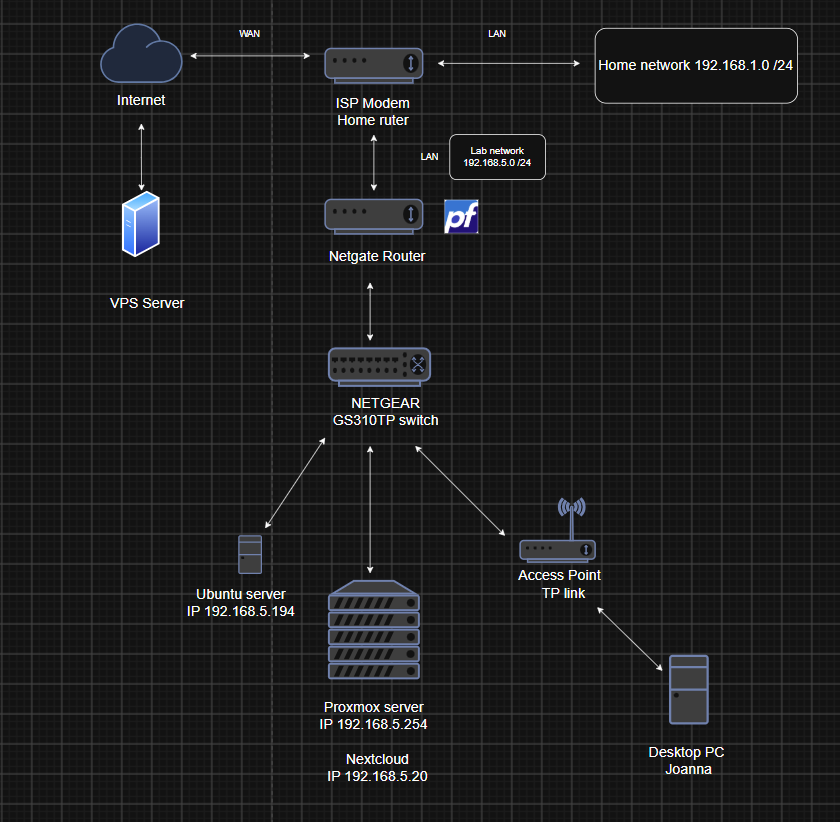

# VM Lab Environment Setup

This project documents the setup of the virtual lab environment used for my cybersecurity projects.

The environment is built using Proxmox and includes an isolated lab network containing attacker, target and monitoring systems.

My work included configuring the virtual lab network, assigning network interfaces and IP addresses to the virtual machines, and verifying connectivity between the systems.

Some parts of the underlying infrastructure and remote access configuration were completed in collaboration with my colleague, who hosts the physical equipment.

## Documentation

Full step-by-step documentation of the lab environment setup is available below:

 [VM Lab Environment Setup – Full Documentation](./VM%20Lab%20Environment%20Setup.pdf)

## Current Lab Topology

The diagram below shows the current lab architecture. The environment has continued to develop since the original setup documentation was created, including the integration of a public-facing VPS used for security monitoring.

